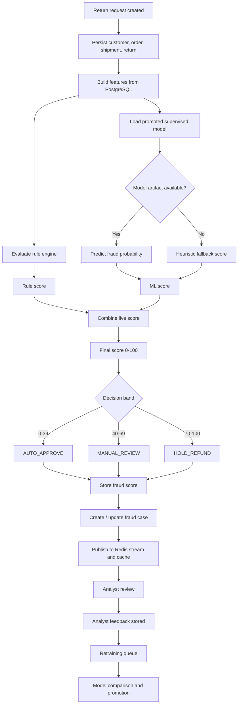

# ReturnShield AI Business Logic Architecture

This diagram shows the current production decision path from return intake to model feedback.

## Current Decision Logic

- The live production score is rule-led and supervised-ML weighted.
- NLP, graph, and anomaly signals remain supporting evidence for explanation.
- The scorer falls back to a heuristic path when no promoted artifact exists.
- Every score is retained for audit, review, and retraining.

## Model Lifecycle

1. Pull training rows from PostgreSQL.
2. Preprocess structured and categorical features.
3. Train Logistic Regression, Random Forest, XGBoost, and Neural Network models.
4. Compare models primarily by PR-AUC, then F1, then false positive rate.
5. Promote the best artifact into `backend/models/best_model/`.
6. Cache metadata in Redis for fast lookups.
