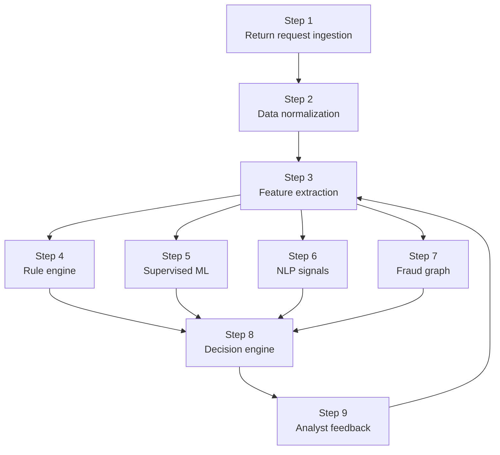

# Decisioning Architecture

Rule-led flow with supervised scoring and analyst feedback.

## Overview

ReturnShield AI uses a layered decision path. Rules provide fast guardrails, supervised ML handles the main fraud probability, and NLP plus graph signals add context for explanation and investigation. Analyst feedback closes the loop so the system improves over time.

## Flow

## Step Breakdown

1. Return request ingestion
2. Data normalization
3. Feature extraction
4. Rule engine
5. Supervised ML
6. NLP signals
7. Fraud graph
8. Decision engine
9. Analyst feedback

## How The Layers Work

- Return request ingestion captures the raw return event and related merchant context.
- Data normalization standardizes the request payload so downstream scoring is consistent.
- Feature extraction builds the structured inputs used by the rule engine and supervised model.
- Rule engine applies known policy and fraud guardrails immediately.
- Supervised ML estimates fraud probability from the labeled return history.
- NLP signals inspect return reason text and support interactions for suspicious language.
- Fraud graph highlights connected identities, devices, payment tokens, and refund accounts.
- Decision engine combines the scores into an action: approve, review, or hold.
- Analyst feedback stores the final human decision and becomes the retraining signal.

## Current Production Path

- Primary scoring path: `rules -> supervised ML -> decision engine`
- Supporting signals: `NLP -> fraud graph -> explanation`
- Learning loop: `analyst feedback -> retraining -> model promotion`

## Notes

- The system keeps a fallback path available when a promoted ML artifact is missing.
- The architecture is designed to stay explainable for operations, audit, and support teams.
